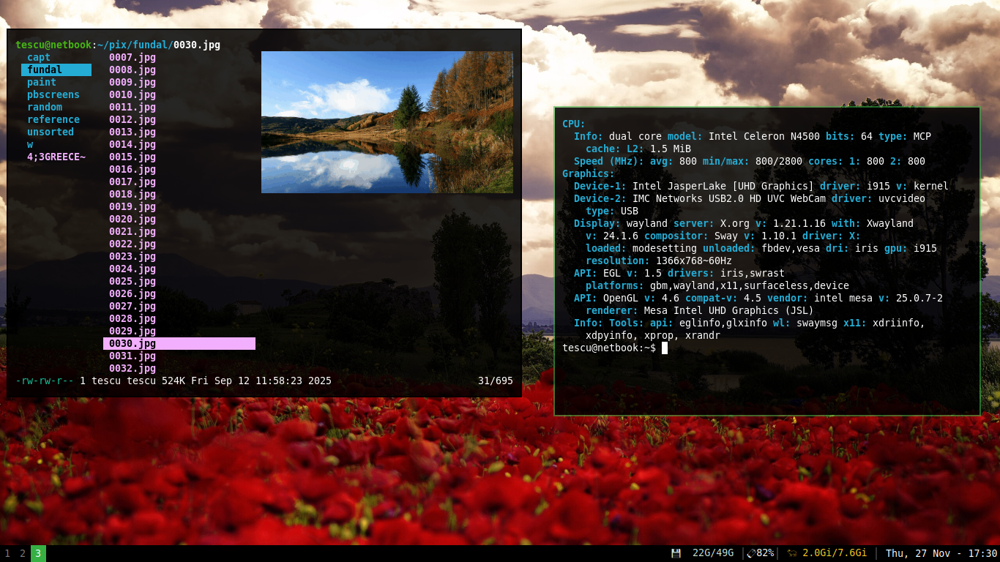

# dots

Configuration files and other utilities I have written for convenience.

### screenshot

### dependencies

* main: labwc, swaybg, wofi, foot, waybar, fzf, brightnessctl, grim (+ slurp), fnott, libnotify-bin (notify-send), wlopm

* extra: mpv, nsxiv, lf, img2sixel, chara, w3m, thunar

### file structure

All shell scripts are stored in the `bin/` folder. Additional files (shared files, configurations) are to be stored in `etc/`.
This maps to `~/.local/bin` and `~/.local/etc` on my system.

### keybinds

M: Super key/Mod4
A: Alt key
S: Shift key

| keybind   | action         |
|-----------|----------------|
| M+Return  | terminal       |
| M+S+c     | close window   |
| M+S+r     | restart        |
| M+d       | programs (wofi)|
| M+1..5    | go to desktop  |
| M+S+1..5  | send to desktop|
| M+a       | labwc menu     |
| M+e       | file manager   |
| M+f       | fullscreen     |
| M+x       | no decorations |
| M+o       | change wall.   |
| M+w       | emoji menu     |
| M+S+w     | lenny faces    |
| M+m       | mount drives   |
| M+S+m     | umount         |
| M+p       | screenshot     |
| M+S+m     | scr. region    |
| M+s       | skip mpl track |
| M+S+s     | stop mpl       |
| M+h       | snap left      |
| M+j       | snap down      |
| M+k       | snap up        |
| M+l       | snap right     |
| A+h       | move left      |
| A+j       | move down      |
| A+k       | move up        |
| A+l       | move right     |

### scripts

Some scripts you may find interesting/cool are:

* `mpl` & `mplc`: mpv-based music player that plays random songs in a given directory

* `psalmi`: display a random psalm in the terminal (in Romanian, but should work with any language, so long the file is formated in the same tsv format)

* `fetch`: KISS screenfetch clone

* `pickerm`: program used to select emojis, lenny faces, and even bookmarks!

* `bmadd`: writes the content of your clipboard into a bookmark file

* `wpmenu`: set your sway wallpaper using nsxiv

* `dexcli`: gets a definition from [dex.ro](https://dex.ro) on the terminal

### license
GPLv3 unless otherwise mentioned
